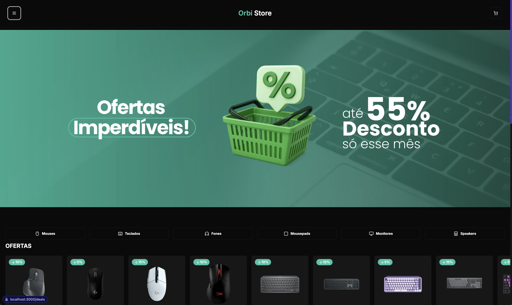
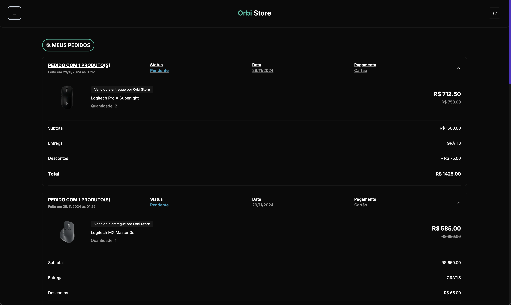
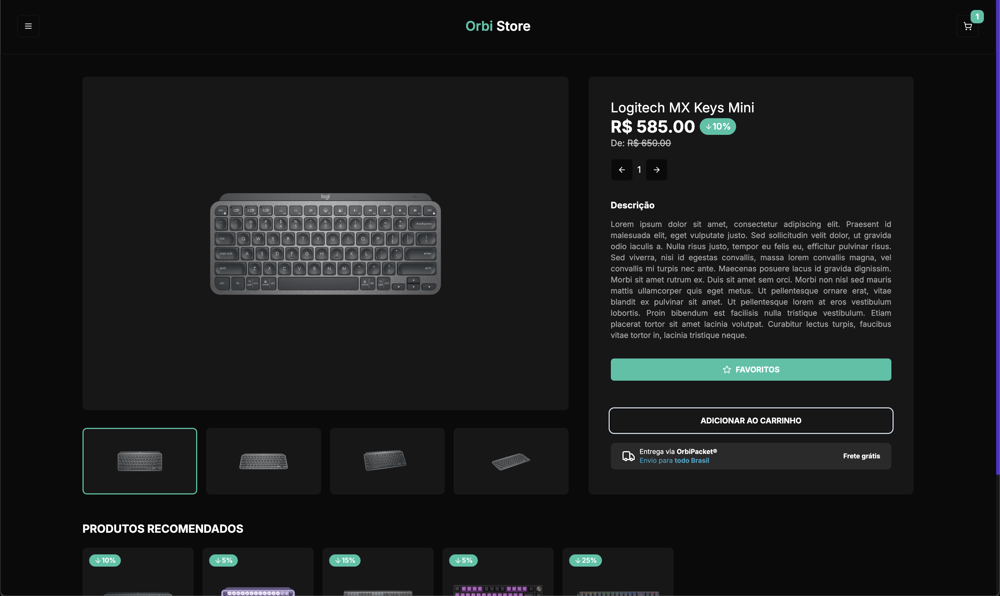
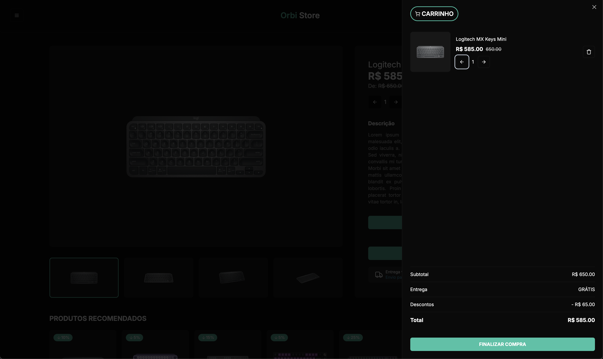
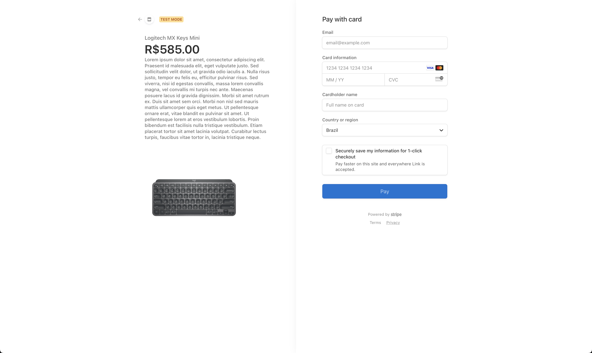

# 🛒 Store Nexus

> Uma aplicação full-stack de comércio eletrônico, desenvolvida com Next.js e tecnologias modernas, para vender produtos online com segurança e escalabilidade.

---

## 🚀 Funcionalidades

- **Catálogo de produtos**
- **Carrinho de compras**
- **Checkout integrado ao Stripe**
- **Autenticação e autorização**
- **Painel de administração**
- **Dashboard de pedidos**
- **Persistência de dados**

---

## 🛠️ Stack Tecnológica

| Camada         | Ferramenta / Biblioteca                                     |
| -------------- | ----------------------------------------------------------- |
| **Frontend**   | Next.js 14 (App Router), React 18, TypeScript, Tailwind CSS |
| **Backend**    | Next.js API Routes, Prisma ORM, PostgreSQL                  |
| **Auth**       | NextAuth.js, Google Provider                                |
| **Pagamentos** | Stripe (Checkout + Webhooks)                                |
| **Dev & Ops**  | Docker Compose, Vercel (frontend)                           |
| **Qualidade**  | ESLint, Prettier, Husky + lint-staged                       |

---

## 💾 .env.example

Renomeie este arquivo para `.env` e preencha cada variável:

```env
# PostgreSQL
DATABASE_URL="postgresql://<USER>:<PASSWORD>@<HOST>:<PORT>/<DATABASE>?sslmode=require"

# OAuth Google
GOOGLE_CLIENT_ID="<sua_client_id_do_google>"
GOOGLE_CLIENT_SECRET="<seu_client_secret_do_google>"

# Stripe
STRIPE_SECRET_KEY="<sua_chave_secreta_da_stripe>"
STRIPE_WEBHOOK_SECRET_KEY="<seu_webhook_secret_da_stripe>"
NEXT_PUBLIC_STRIPE_PUBLIC_KEY="<sua_chave_publica_da_stripe>"

# NextAuth
NEXTAUTH_SECRET="<uma_string_segura_para_encriptacao>"

# URL base da aplicação
HOST_URL="http://localhost:3000"
```

## ⚙️ Instalação e Execução

1. Clone o repositório

```
git clone https://github.com/feliperogerioalmeida/storeNexus.git
cd storeNexus
```

2. Preencha as variáveis de ambiente

```
cp .env.example .env
# edite .env conforme as instruções acima
```

3. Suba o banco de dados local (opcional)

Se quiser um PostgreSQL local com Docker Compose:

```
docker-compose up -d
```

4. Instale as dependências

```
npm install
```

5. Rode migrações e gere o client do Prisma

```
npx prisma migrate dev --name init
```

6. Inicie o servidor de desenvolvimento

```
npm run dev
```

7. Stripe Listening

Para receber webhooks em desenvolvimento, execute:

```
stripe listen --forward-to localhost:3000/api/webhooks
```

8. Acesse

Abra http://localhost:3000 no seu navegador.

## 📸 Exemplos de Interface

- Home / Landing Page
<p align="center">
 
  
</p>

- Menu Lateral
<p align="center">
 
  
</p>

- Menu Lateral Autenticado
<p align="center">
 
  
</p>

- Meus Pedidos

<p align="center">
 
  
</p>

- Favoritos
<p align="center">
 
  
</p>

- Produto

<p align="center">
 
  
</p>

- Carrinho de compras

<p align="center">
 
  
</p>
- Checkout com Stripe
<p align="center">
 
  
</p>

## 📦 Scripts Úteis

<table>
<tr>
<th>Comando</th>
<th>Descrição</th>
</tr>
<tr>
<td> npm run dev</td>
<td> Inicia em modo desenvolvimento</td>
</tr>
<tr>
<td> npm run build</td>
<td> Gera build de produção</td>
</tr>
<tr>
<td> npm run start</td>
<td> Roda aplicação em produção</td>
</tr>
<tr>
<td> npx prisma migrate
</td>
<td> Gestão de migrações do banco de dados</td>
</tr>
<tr>
<td> npx prisma studio</td>
<td> Interface web para inspecionar o banco local</td>
</tr>
</table>

## 🤝 Contribuindo

1. Abra uma issue para discutir sua ideia.
2. Faça um fork e crie uma branch (git checkout -b feature/minha-feature).
3. Siga o padrão de lint/format e faça commits atômicos.
4. Abra um Pull Request descrevendo sua contribuição.

## 📄 Licença

Este projeto está licenciado sob a MIT License. Veja o arquivo LICENSE para mais detalhes.
